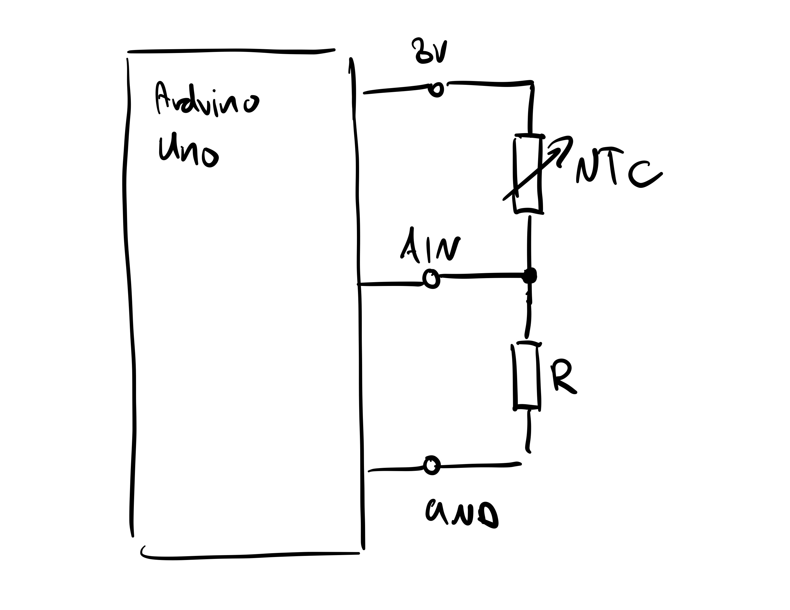
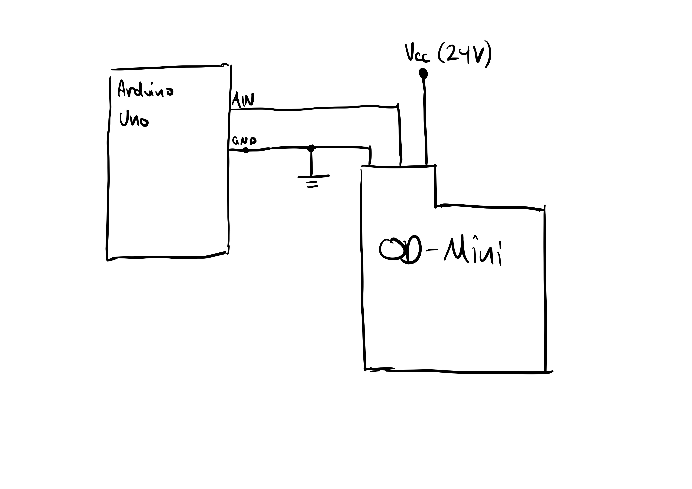
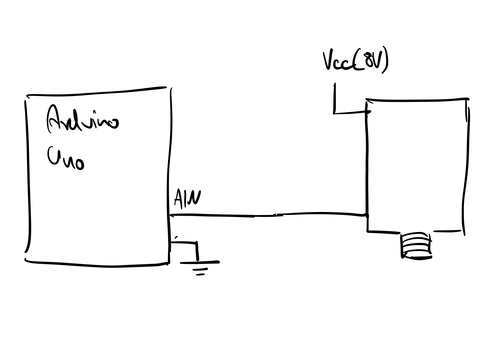
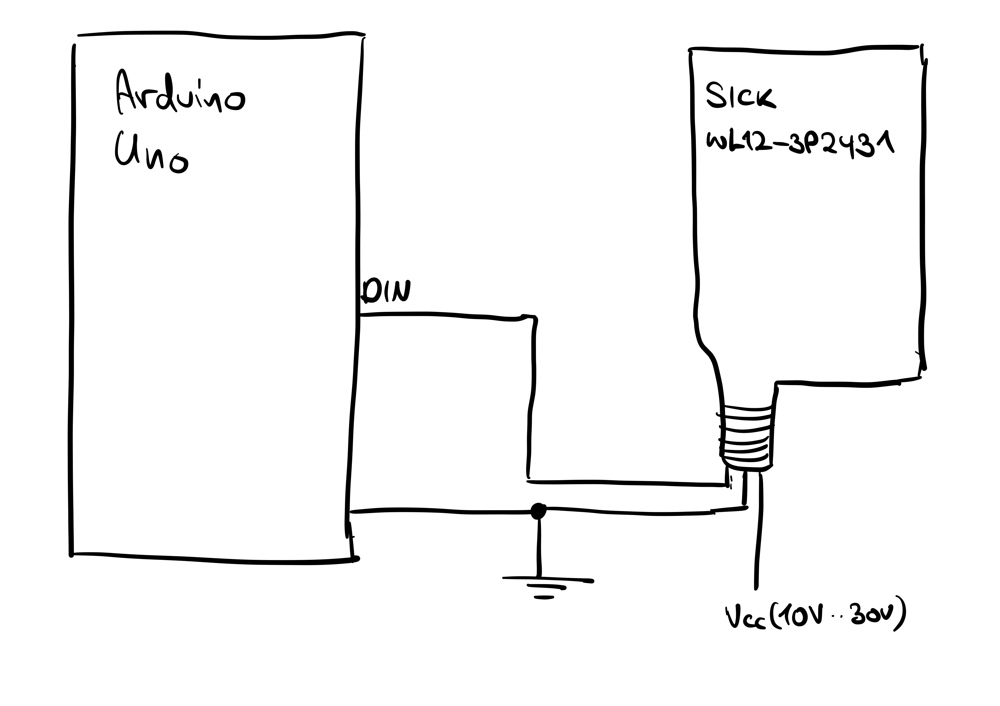

### T-E - Sensors 

<!-- Section 1. - 7. should be filled out **before** the test is performed! -->

#### 1. Aim/Objectives
The testing is required to validate and configure the mapping of the 
sensor readings to the sensor output.
Testing will always be done in a minimal circuit which reproduces the wiring 
structure that will be present in the pod.
#### 2. Infrastructure and Setup

##### NTC-Sensor Setup
<html>

 
<html/>
Testing of the NTC-Sensors is really easy we just create a voltage divider
and read the values using a Arduino Uno.

##### OD-Mini Setup
<html>

 
<html/>
The testing setup of the od-mini is a bit more compilcated. First it also 
requires a aduino uno to read the voltage 
values and perform a simple convertions 
from the adc range to meters. In addition 
a 12-24V power supply is required in the complete pod the pdu will take 
this place but for testing purposes any power supply can be used.

##### Pneumatic-Pressure-Sensor Setup
The Pneumatic Pressure sensor can be configured in different ways one option is
to just use treat the sensor as a varyable resistor.
<html>

 
<html/>
It is important to test different setups for the pressure sensor
(see the sensor datasheet for more configuration options) 
to find the one which is most suitable for our purposes.

##### Kistler Sensor Setup 
Testing the Kistler sensors might be the hardest tests to perform of the 
3 mentioned above.
A power supply and a can logger have to be connected to read the sensor values
afterwards the sensor can be tested by collection all reading on the can
bus and later anaylse them by integrating. If the integrated speed values 
is the same as length the sensor has moved during testing the sensor readings 
are valid. It should be noted that the distance of the sensor to the 
plane, which it measures on (floor) should be correctly adjusted 
based on the last seasons configuration.

##### Fiducial Sensor Setup
<html>

 
<html/>
The Fiducial Sensor is a PNP Sensor, therefor the minimal 
required setup is very easy and a microcontroller is not 
even really required, but still helpful.
One thing which is important to test here is the range 
and the responsiveless to different reflectors.

#### 3. Description
All mentioned tests above follow the same principle 
the setup is supposed to be as minmal as possible, for 
gather the information required.
Testing is also a part of development which is why the mappings of the 
sensor values can be directly implemented in arduino and later be
used, with minor changes, on the ECUs or th MDBs. 
Some sensors might require additional tests to be performaned,
currently they are listed above in the Infastruture and Setup section.

#### 4. Test specific Risks
- Sensor damage through incorrect configuration.
- Eye damage (only applies to laser Sensors)
Due to no HV beeing pressent in the system the risk for 
testing are realtivly low.

#### 5. Testing Protocol 
- setup minimal circuit.
- test sensors without arduino uno just a voltmeter or osziloscope.
- write arduino code to interpret the values and convert them based 
  on the datasheet.
- finally test integration with BCU-Shields/Teency4 and PDU.

*Sensor values will be tested with a Arduino Uno first because configuring the 
in ECUs is more complex.*

<!--

#### 6. Setpoints/Conditions
  * //Summary of variables within the test?//
  * //Load cases, pressure, voltage, current speed, etc.//
  * //Possible way of documentation: //
    * //Table structure: e.g. Variable - Setpoints - Description//

----
^ Variable  ^ Setpoints  ^ Conditions  ^
| FIXME     | FIXME      | FIXME       |

#### 7. Expected Results

  * //Which results can be expected?//
  * //Possible way of documentation://
    * //Text//
    * //Graphics//

----
FIXME

#### 8. Measurement Data and Results
  * //Data and Processed results//
  * //Possible way of documentation://
    * //For analog data: Create dedicated section or table here to be filled out during tests//
    * //For digital data: Store it in FMS//
  * //Standardized plots: Template FIXME//
  * //Stored in FMS: Link FIXME//

----
FIXME

#### 9. Interpretation
  * //Comparison between expected results and measurement data//
  * //What do the test results mean for the subsystem and the overall system?//

----
  * FIXME

#### 10. Conclusion
  * //Measures//
  * //Okay / not okay//
  * //Test passed and integration can continue...//

----
  * FIXME
  -->
